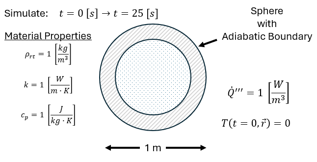
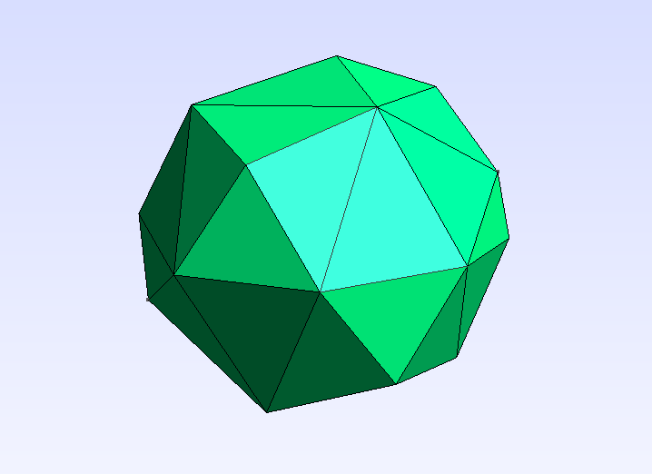
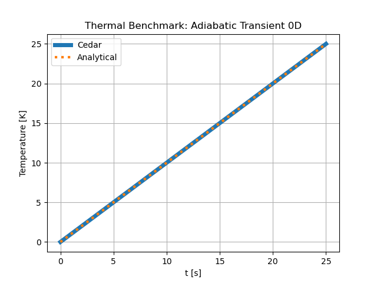

AdiabaticTransient0D
====================

An arbitrary problem to test the time derivatives of the ``Thermal`` model.
Since it has adiabatic boundaries with a uniform volumetric heat generation, the
problem effectively reduces down to a time-dependent point value. The geometry
and domain discretization should have no impact on the solution.

Problem Statement
-----------------

   An illustration of the problem.

   The meshed domain, created using GMSH.

Reference Data
--------------

The reference data for this problem comes from an analytical solution.

Start from the governing equation for heat transfer.

.. math::
    \rho(\vec{r}) c_p(T, \vec{r}) \frac{\partial T}{\partial t} - \nabla (k(T, \vec{r}) \nabla T) = q'''

Where

| :math:`\rho` is mass density :math:`[\frac{kg}{m^3}]`
| :math:`c_p` is specific heat capacity :math:`[\frac{J}{kg K}]`
| :math:`T` is temperature :math:`[K]`
| :math:`k` is thermal conductivity :math:`[\frac{W}{m K}]`
| :math:`q'''` is volumetric internal heat source :math:`[\frac{W}{m^3}]`

Since the problem has adiabatic boundaries with uniform volumetric heat
generation, the spatial temperature gradient is always zero.

.. math::
    \rho(\vec{r}) c_p(T, \vec{r}) \frac{d T}{d t} = q'''

Density and specific heat capacity are defined as constant, uniform values.

.. math::
    \rho c_p \frac{d T}{d t} = q'''

Plug in values of density, specific heat capacity, and volumectric heat generation.

.. math::
    1 \cdot 1 \cdot \frac{d T}{d t} = 1

.. math::
    \frac{d T}{d t} = 1

Integrate.

.. math::
    T(t) = t + C

Apply initial condition.

.. math::
    T(0) = 0

.. math::
    T(t) = t

Cedar Input
-----------

.. code-block:: python

    mesh = cedar.Mesh3D("cedar/benchmarks/thermal/adiabatic_transient_0d/adiabatic_transient_0d.msh")

    material = cedar.materials.ConstantMaterial(rho_rt = 1, k = 1, cp = 1)

    thermal = cedar.models.Thermal("thermal", mesh)
    thermal.set_material("volume", material)
    thermal.set_Qdot(mesh.vol)
    thermal.vars.T.set_initial(0)
    thermal.vars.T.set(0)

    problem = cedar.Problem("Adiabatic Transient 0D", create_outputs = False)
    problem.add_model(thermal)

    T_vals = np.zeros(26)

    for i in range(25):
        problem.solve(dt = 1, t0 = i, t_end = i+1)
        T_vals[i+1] = np.average(thermal.vars.T.val)

Comparison
-----------

MAPE = 0.0 [%]

   Temperature in [K].