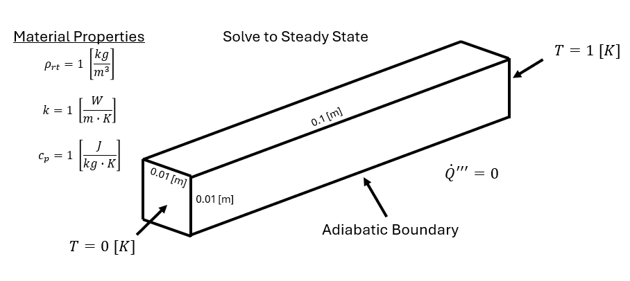
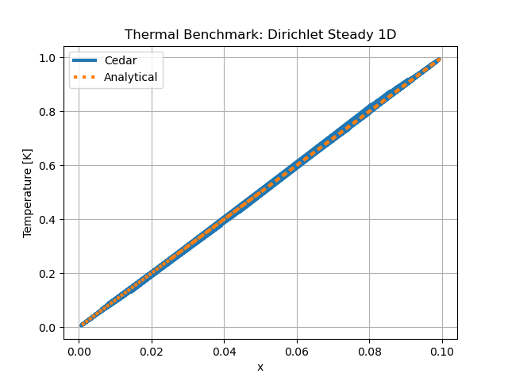

DirichletSteady1D
====================

An arbitrary problem to test the spatial derivatives of the ``Thermal`` model
and Dirichlet boundary conditions. The problem is setup no with heat
generation, so the temperature distribution should be linearly increasing from
the left boundary to the right boundary

Problem Statement
-----------------

   An illustration of the problem. This is the same computation domain defined by NAFEMSTransient1D.

.. figure:: img/dirichletsteady1d_mesh.png
   :scale: 75 %
   :align: center

   The meshed domain, created using GMSH. This is the same mesh defined by NAFEMSTransient1D.

Reference Data
--------------

The reference data for this problem comes from an analytical solution.

Start from the governing equation for heat transfer.

.. math::
    \rho(\vec{r}) c_p(T, \vec{r}) \frac{\partial T}{\partial t} - \nabla (k(T, \vec{r}) \nabla T) = q'''

Where

| :math:`\rho` is mass density :math:`[\frac{kg}{m^3}]`
| :math:`c_p` is specific heat capacity :math:`[\frac{J}{kg K}]`
| :math:`T` is temperature :math:`[K]`
| :math:`k` is thermal conductivity :math:`[\frac{W}{m K}]`
| :math:`q'''` is volumetric internal heat source :math:`[\frac{W}{m^3}]`

Since the problem is being solved to steady state, the time derivative is zero.

.. math::
    - \nabla (k(T, \vec{r}) \nabla T) = q'''

From problem statement, there is no heat generation.

.. math::
    \nabla (k(T, \vec{r}) \nabla T) = 0

Thermal conductivity is constant and uniform, so it can be taken outside of the gradient.

.. math::
    k \nabla^2 T = 0

.. math::
    \nabla^2 T = 0

Integrate twice.

.. math::
    \nabla T = C_1

.. math::
    T(x) = C_1 x + C_2

Apply BCs.

.. math::
    T(0) = 0
    T(0.1) = 1

.. math::
    T(x) = 10 x

Cedar Input
-----------

.. code-block:: python

    mesh = cedar.Mesh3D("cedar/benchmarks/thermal/dirichlet_steady_1d/dirichlet_steady_1d.msh")

        material = cedar.materials.ConstantMaterial(1, 1, 1)

        thermal = cedar.models.Thermal("thermal", mesh)
        thermal.set_material("volume", material)
        thermal.set_bc("left", "dirichlet", 0)
        thermal.set_bc("right", "dirichlet", 1)
        thermal.vars.T.set_initial(0.5)
        
        problem = cedar.Problem("DirichletSteady1D", create_outputs = False)
        problem.add_model(thermal)
        problem.solve()

Comparison
-----------

MAPE = 2.2 [%]

   Temperature in [K].