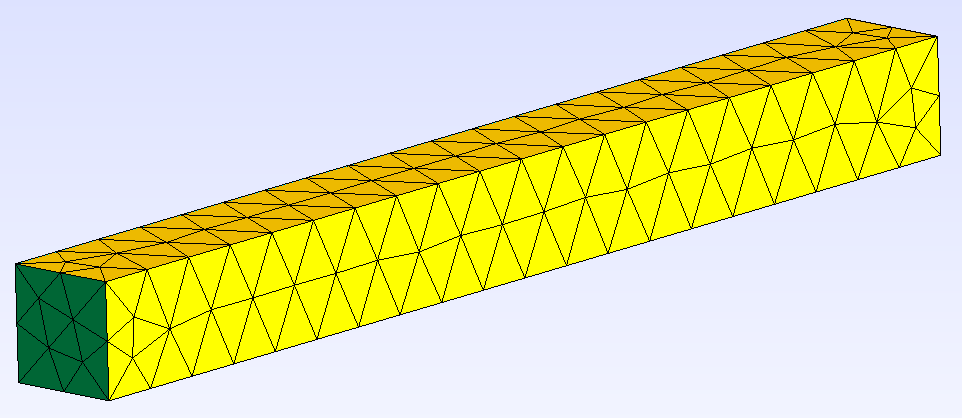
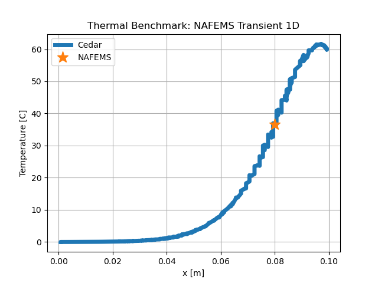

NAFEMSTransient1D
====================

This is a transient problem that comes from The Standard NAFEMS
Benchmarks [NAFEMS_1990]_. It tests the ``Thermal`` model's ability to handle
time-dependent boundary conditions, time derivatives, and spatial derivatives.

Problem Statement
-----------------

A 0.1 [m] long bar has a height of 0.01 [m] and a depth of 0.01 [m]. There is no
internal heat generation.

   The meshed domain, created using GMSH.

At t = 0, the temperature is uniform at 0 [C].

The left boundary is a Dirichlet BC and is held constant at all times at T = 0 [C]

The right boundary is a Dirichlet BC and is a function of time, where T = 100 sin(pi t / 40) [C]

The material properties are uniform and constant as follows:

- :math:`k = 35.0 [\frac{W}{m C}]`
- :math:`c_p = 440.5 [\frac{J}{kg C}]`
- :math:`\rho = 7200 [\frac{kg}{m^3}]`

The total simulation time is 32 [s].

Reference Data
--------------

At t = 32 [s], the temperature at a position of x = 0.08 [m] is known to be **36.6 [C]**.

Cedar Input
-----------

.. code-block:: python

    mesh = cedar.Mesh3D("cedar/benchmarks/thermal/nafems_transient_1d/nafems_transient_1d.msh")

    material = cedar.materials.ConstantMaterial(7200, 35, 440.5)

    thermal = cedar.models.Thermal("thermal", mesh)
    thermal.set_material("volume", material)
    thermal.set_bc("left", "dirichlet", 0)
    thermal.set_bc("right", "dirichlet", 0)
    thermal.vars.T.set_initial(0)
    thermal.vars.T.set(0)
    
    def right_bc_func(t):
        return 100 * np.sin(np.pi*t/40)
    
    right_bc = cedar.models.ScalarFromFunc("Right BC", "K", right_bc_func)

    problem = cedar.Problem("NAFEMS_1D_Transient", create_outputs = False)
    problem.add_model(right_bc)
    problem.add_model(thermal)

    problem.couple(right_bc.vars.scalar, thermal.vars.bcs["right"], cedar.adapters.NearestValue)

    problem.solve(dt = 1, t_end = 32)

Comparison
-----------

MAPE = 0.4 [%]

   Temperature in [C].

References
----------

.. [NAFEMS_1990] National Agency and Standards for Finite Element Methods, “The Standard NAFEMS Benchmarks, Rev. 3,” Oct. 1990.