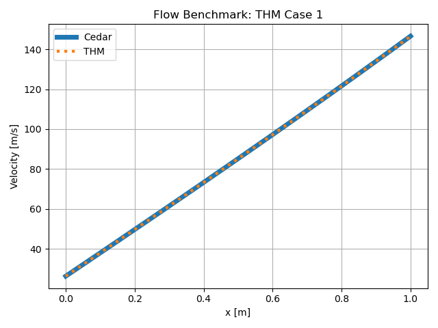
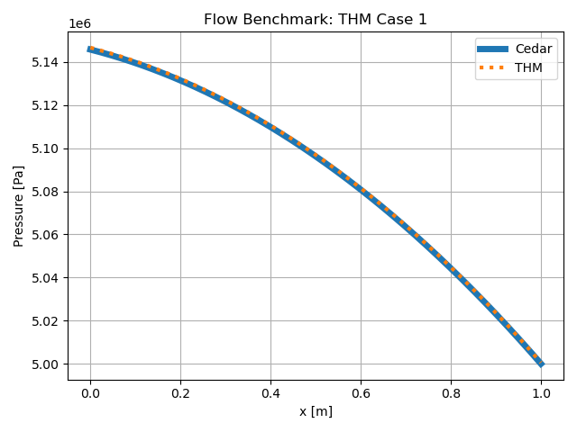
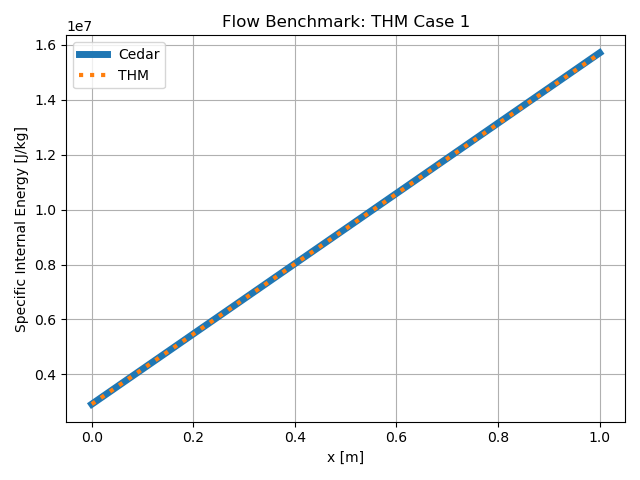
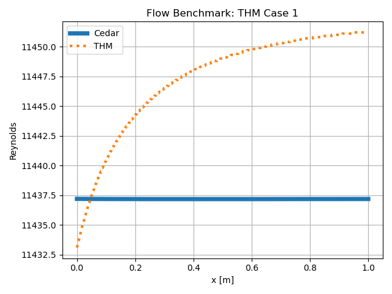
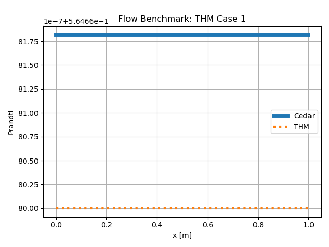

THMCase1
==========

An arbitrary problem to compare the ``Flow`` model in Cedar to the MOOSE THM.
This is internal flow through a cylindrical flow channel with uniform heat
addition and wall friction effects.

Problem Statement
-----------------

The problem is the same as the example given here:
:doc:`../examples/03_heated_channel`

.. figure:: img/thmcase1_diagram.png
   :scale: 65 %
   :align: center

   An illustration of the problem.

.. note::
    The pressure boundary condition and the heating values are different between THM and Cedar due to the form thats accepted. Cedar uses stagnation pressure and total heating, THM uses static pressure and volumetric heating. Values are selected such the physics modeled are equivalent.

Reference Data
--------------

**MOOSE Input File**

.. code-block:: text

    [GlobalParams]
        scaling_factor_1phase = '1e-9 1e-9 1e-9'
    []

    [AuxVariables]
        [k_fluid_out]
            order = CONSTANT
            family = MONOMIAL
            block = 'fch0'
        []
        [cp_fluid_out]
            order = CONSTANT
            family = MONOMIAL
            block = 'fch0'
        []
        [cv_fluid_out]
            order = CONSTANT
            family = MONOMIAL
            block = 'fch0'
        []
        [mu_fluid_out]
            order = CONSTANT
            family = MONOMIAL
            block = 'fch0'
        []
        [Re_fluid_out]
            order = CONSTANT
            family = MONOMIAL
            block = 'fch0'
        []
        [Pr_fluid_out]
            order = CONSTANT
            family = MONOMIAL
            block = 'fch0'
        []
        [M_fluid_out]
            order = CONSTANT
            family = MONOMIAL
            block = 'fch0'
        []
    []

    [AuxKernels]
        [Record_M]
            type = MachNumberAux
            variable = M_fluid_out
            vel = vel_x
            v = v
            e = e
            fp = fp
            block = 'fch0'
        []
        [Record_k]
            type = ADMaterialRealAux
            property = k
            variable = k_fluid_out
            block = 'fch0'
        []
        [Record_Cp]
            type = ADMaterialRealAux
            property = cp
            variable = cp_fluid_out
            block = 'fch0'
        []
        [Record_Cv]
            type = ADMaterialRealAux
            property = cv
            variable = cv_fluid_out
            block = 'fch0'
        []
        [Record_mu]
            type = ADMaterialRealAux
            property = mu
            variable = mu_fluid_out
            block = 'fch0'
        []
        [Record_Re]
            type = ReynoldsNumberAux
            variable = Re_fluid_out
            block = 'fch0'
            rho = rho
            vel = vel_x
            D_h = 0.0029999985270413587
            v = v
            e = e
            fp = fp
        []
        [Record_Pr]
            type = PrandtlNumberAux
            variable = Pr_fluid_out
            v = v
            e = e
            fp = fp
        []
    []

    [FluidProperties]
        [fp]
            type = IdealGasFluidProperties
            gamma = 1.42614770459
            k = 0.7018
            molar_mass = 0.00201588
            mu = 2.8710e-5
        []
    []

    [Closures]
        [closures]
            type = Closures1PhaseTHM
        []
    []

    [Components]
        [fch0]
            type = FlowChannel1Phase
            position = '0 0 0'
            orientation = '1 0 0'
            length = 1
            n_elems = 1000

            A = 0.00000706858
            roughness = 200e-6
            fp = fp
            closures = closures

            gravity_vector = '0 0 0'

            initial_T = 500
            initial_p = 5e6
            initial_vel = 10
        []
        [inlet]
            type = InletMassFlowRateTemperature1Phase
            input = fch0:in
            T = 300
            m_dot = 0.00077368421
        []
        [outlet]
            type = Outlet1Phase
            input = fch0:out
            p = 5e6
        []
        [heat_source]
            type = HeatSourceVolumetric1Phase
            flow_channel = fch0
            q = 2e9
        []
    []

    [Preconditioning]
        [pc]
            type = SMP
            full = true
        []
    []

    [Executioner]
        type = Steady
        solve_type = NEWTON
    []

    [Outputs]
        exodus = true
        csv = true
    []

Cedar Input
-----------

.. code-block:: python

    problem = cedar.Problem("test_flow", create_outputs = False)

    mesh = cedar.Mesh1D(1000, 0, 1, "fc", "fc_wall")
    fluid = cedar.fluids.IdealGas(k = 0.7018, cp = 13803, mu = 2.8710e-5, molar_mass = 2.01588)
    flow = cedar.models.Flow("flow", mesh, fluid, Dh = 0.003, 
                                A = 0.00000706858, P_wall = 0.00942477796, eps = 200e-6)

    flow.vars.inlet.set([300, 5008026, 0.00077368421])
    flow.vars.outlet.set([300, 5008026, 0.00077368421])
    flow.vars.P.set_initial(5e6)

    flow.vars.Qdot.set(14137.16)

    problem.add_model(flow)
    problem.solve()

Comparison
-----------

MAPE = 0.1 [%]

   Velocity.

.. figure:: img/thmcase1_T.png
   :scale: 100 %
   :align: center

   Temperature.

   Pressure.

   Internal Energy.

   Reynolds Number.

   Prandtl Number.