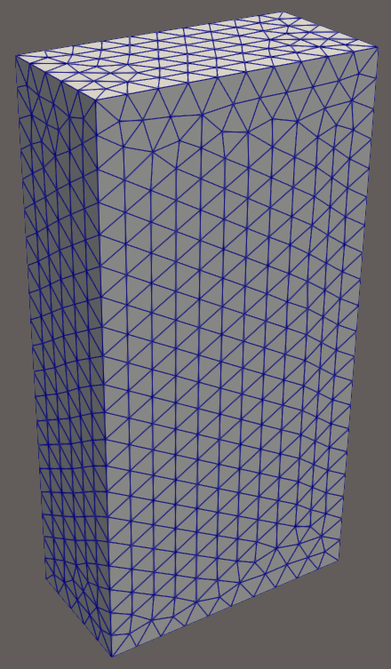
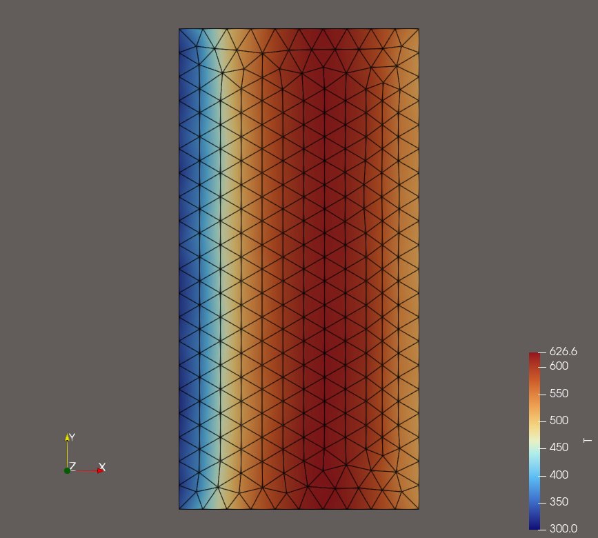

01 - Box Heat Transfer
======================

This is one of the simplest problems that can be defined in Cedar. The problem
contains a single model and is solved to steady state with no coupling to any
other models.

    The meshed domain, created using GMSH.

A ``Heat Transfer`` model is defined using the "box mesh" shown above as the
computational domain. The boundaries are intuitively defined as "left", "right",
"top", "bottom", "front", and "back". The single region in this mesh is defined
as "volume". The steady state heat conduction equation is solved on this 3D
domain using the Finite Volume Method. The boundary conditions are a fixed value
of 300 K on the left boundary, and 500 K on the right boundary. All other
boundaries are adiabatic, so although this computational domain is 3D, the
problem is effectively 3D. A uniform heat source is applied totalling 50 kW of
heat deposited in the domain.

Create the Mesh
---------------

A ``Mesh3D`` object is required to instantiate a ``Heat Transfer`` model. While the
mesh was created using GMSH, Cedar requires a VTKHDF file format to define the
mesh, so the .msh file must be converted to a .vtkhdf file. Cedar includes a
useful utility to accomplish this: ``cedar.functions.gmsh_to_vtkhdf()``

.. code-block:: python

    import cedar

    # Create Mesh for Heat Transfer Model
    mesh = cedar.Mesh3D("examples/01_box_thermal/box_heat_transfer.vtkhdf")

Instantiate the Heat Transfer Model
-----------------------------------

Now that we have the ``Mesh3D`` ready, we can instantiate the ``Heat Transfer``
model. Each Cedar ``Model`` has unique parameters, so refer to the documentation
of each ``Model`` to correctly define it. In the case of the ``Heat Transfer``
model, the only requirement for instantiation is a ``Mesh3D``.

.. code-block:: python

    # Instantiate Model
    ht = cedar.HeatTransfer(mesh)

Define Model Parameters
-----------------------

A ``Heat Transfer`` model requires you to define the materials and the initial
conditions. In addition, the boundary conditions (which default to
``AdiabaticBC`` for every boundary) and the heat source (which defaults to no
source) should be adjusted where necessary for your problem.

For this example, we set the material to ``ZrC``, the heat source to 50 kW, the
left boundary condition to 300 K, the right boundary condition to 500 K, and the
initial condition to 400 K.

.. code-block:: python

    ht.materials = {
        "volume" : cedar.materials.ZrC()
    }

    # Set Heat Source
    ht.source = cedar.HeatSource(5e4)

    # Set Boundary Conditions (Default is Adiabatic)
    ht.bc = {
        "left" : cedar.FixedTemperatureBC(300),
        "right" : cedar.FixedTemperatureBC(500)
    }

    # Set Initial Conditions
    ht.T.ic = 400

Instantiating a Problem
-----------------------

A ``Problem`` is a collection of models that are to be solved together. It is
responsible for storing models, coupling data, and writing outputs. You can
think of it as the conductor of the Cedar orchestra.

In this case, we instantiate the problem object, and add only 1 model to it (the
heat transfer model).

.. code-block:: python

    # Create Problem
    problem = cedar.Problem()
    problem.add_model(ht)

All that is left is to solve the problem. This will create an output file named ``output.vtkhdf``.

.. code-block:: python

    problem.solve()

Entire Example Problem File
---------------------------

.. code-block:: python

    import cedar

    # Create Mesh for Heat Transfer Model
    mesh = cedar.Mesh3D("examples/01_box_heat_transfer/box_heat_transfer.vtkhdf")

    # Instantiate Model
    ht = cedar.HeatTransfer(mesh)

    ht.materials = {
        "volume" : cedar.materials.ZrC()
    }

    # Set Heat Source
    ht.source = cedar.HeatSource(5e4)

    # Set Boundary Conditions (Default is Adiabatic)
    ht.bc = {
        "left" : cedar.FixedTemperatureBC(300),
        "right" : cedar.FixedTemperatureBC(500)
    }

    # Set Initial Conditions
    ht.T.ic = 400

    # Create Problem
    problem = cedar.Problem()
    problem.add_model(ht)

    problem.solve()

Outputs
-------

Below is a temperature contour plot. You can see the left boundary is 300 K, the
right boundary is 500 K, and the cells inbetween show a quadratic function
created by the heat source.

   Temperature contour plot.

In addition to temperature, many variables are saved to outputs including
material properties, source values, and others.