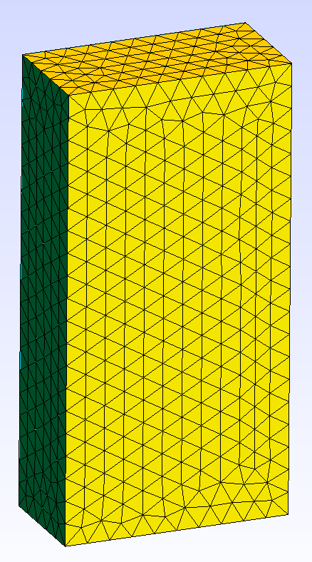
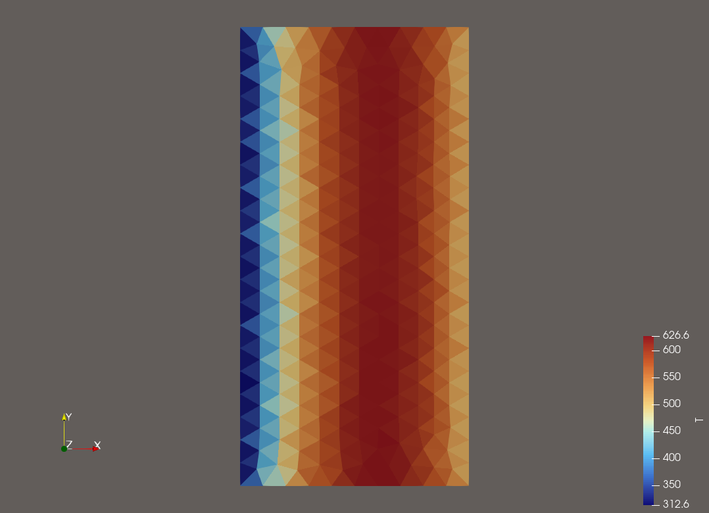

01 - Box Thermal
================

This is one of the simplest problems that can be defined in Cedar. The problem
contains a single model and is solved to steady state with no coupling to any
other models.

    The meshed domain, created using GMSH.

A ``Thermal`` model is defined using the "box mesh" shown above as the computational
domain. The boundaries are intuitively defined as "left", "right", "top",
"bottom", "front", and "back". The single region in this mesh is defined as
"volume". The steady state heat conduction equation is solved on this 3D domain
using the Finite Volume Method. The boundary conditions are a fixed value of 300
K on the left boundary, and 500 K on the right boundary. All other boundaries
are adiabatic, so although this computational domain is 3D, the problem is
effectively 3D. A uniform heat source is applied totalling 50 kW of heat
deposited in the domain.

Instantiating Problem
------------------------

The first step in any Cedar problem is to instantiate the ``Problem`` object with a
problem name as a parameter. The ``Problem`` object holds all of the models and
model connections. 

.. code-block:: python

    import cedar

    # Instantiate Problem Object
    problem = cedar.Problem("box_thermal")

Define Thermal Model Parameters
-------------------------------

Since this problem uses a ``Thermal`` model, we must build a mesh and a material
properties object that will be used by the ``Thermal`` model.

The mesh object should be created using some 3rd-party meshing software. In this
case, we used GMSH. Cedar currently only supports tetrahedron elements, but
development to support other mesh elements is marked for future development.

The material properties objects are pre-defined as part of Cedar's materials
module. We must simply instantiate the specific material we're interested in as
seen below. If custom material properties are required, the Cedar materials
module should be extended to accomodate.

.. code-block:: python

    # Build Mesh for Thermal Model
    mesh = cedar.Mesh3D("box_thermal.msh")

    # Define Material Properties
    ZrC = cedar.materials.ZrC()

Instantiate the Thermal Model
-----------------------------

Now that we have all of the required parameters ready, we can instantiate the
thermal model. Each Cedar ``Model`` has unique parameters, so refer to the
documentation of each ``Model`` to correctly define it. In the case of the
Thermal model, the only parameters required are a name, the 3D mesh, and a
dictionary of material properties where the dictionary keys correspond to each
mesh region.

.. code-block:: python

    # Instantiate Model
    thermal = cedar.models.Thermal("thermal", mesh, {"volume" : ZrC})

Set Source, BCs, and ICs
------------------------

The ``Thermal`` model is instantiated with no source term and Adiabatic boundary
conditions. We use helpful methods that come with the ``Thermal`` model to define
the heat source and boundary conditions, as shown below.

.. code-block:: python

    # Set Heat Source
    thermal.set_Qdot(5e4)

    # Set Boundary Conditions (Default is Adiabatic)
    thermal.set_bc("left", "dirichlet", 300)
    thermal.set_bc("right", "dirichlet", 500)

Each Cedar variable (found in the Model.vars object) has three values associated
with it:

- ``Var.prev_val``: The previous value of ``Var.val``. This is used internally to check for variable convergence.
- ``Var.val``: The current value of the variable.
- ``Var.initial``: If ``Problem`` is steady state, this is the initial guess at the solution. If ``Problem`` is transient, this is the initial value at the start of the timestep.

In this example problem, we set the initial guess at the steady state solution to 500 K.

.. code-block:: python

    # Set Initial Conditions
    thermal.vars.T.set_initial(500)

Add Model to Problem and Solve
------------------------------

Adding the ``Model`` to the ``Problem`` is how we instruct Cedar to solve the ``Model``.

.. note::
    Since there is no coupling between two models in this example problem, no multiphysics iterations are necessary. The ``Problem`` will solve the decoupled ``Model`` to steady state.

Finally, we call Problem.solve() which will solve the problem, and then generate an "outputs" folder in the same folder as the file you ran. The outputs folder will include .csv and .vtk files once the solve is complete.

.. code-block:: python

    # Add Problem to Model and Solve
    problem.add_model(thermal)
    problem.solve()

Entire Example Problem File
---------------------------

.. code-block:: python

    import cedar

    # Instantiate Problem Object
    problem = cedar.Problem("box_thermal")

    # Build Mesh for Thermal Model
    mesh = cedar.Mesh3D("box_thermal.msh")

    # Define Material Properties
    ZrC = cedar.materials.ZrC()

    # Instantiate Model
    thermal = cedar.models.Thermal("thermal", mesh, {"volume" : ZrC})

    # Set Heat Source
    thermal.set_Qdot(5e4)

    # Set Boundary Conditions (Default is Adiabatic)
    thermal.set_bc("left", "dirichlet", 300)
    thermal.set_bc("right", "dirichlet", 500)

    # Set Initial Conditions
    thermal.vars.T.set_initial(500)

    # Add Problem to Model and Solve
    problem.add_model(thermal)
    problem.solve()

Outputs
-------

Below is a temperature contour plot. You can see the left boundary is 300 K, the
right boundary is 500 K, and the cells inbetween show a quadratic function
created by the heat source.

   Temperature contour plot.

In addition to temperature, many variables are saved to outputs including material properties, source values, and others.