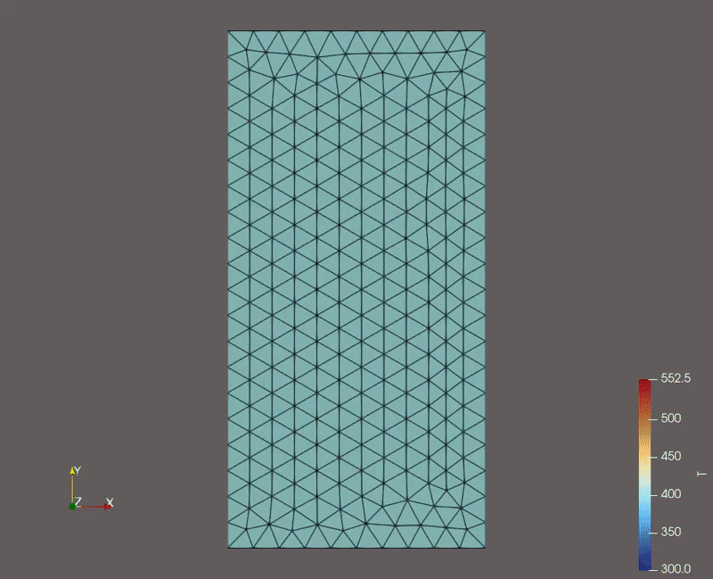

02 - Box Transient Heat Transfer
================================

This example is the exact same as 01 - Box Heat Transfer except that the
``Problem.dt`` ``Problem.t_end`` are adjusted. ``Problem.t_end`` defaults to -1
[s] which directs the ``Problem`` to solve to infinite time (steady state). If
we edit this attribute to some positive value, ``Problem`` will instead perform
a transient solve, starting at ``Problem.t_start``, stepping through timesteps
of length ``Problem.dt``, until reaching ``Problem.t_end``.

The behavior of ``Problem.solve()`` varies between steady state and transient solves.

For Steady State:

- Time derivatives are neglected inside of ``Model.iterate()``
- ``Field.ic`` is the initial guess of the solution variable.
- ``Problem`` only solves one "timestep" (to steady state).
- The output file only has one set of data.

For Transient:

- Time derivatives are included inside of ``Model.iterate()``
- ``Field.ic`` is the initial condition of the solution variable.
- ``Problem`` solves many timesteps. After each timestep is converged, the
  ``Problem`` "steps" forward by setting ``Field.ic`` equal to ``Field.values``
  for all fields.
- The output file has one set of data for each timestep.

Specifying a Transient Solve
----------------------------

Specifying a transient solve is as simple as adjusting the ``Problem.dt`` and ``Problem.t_end`` attributes of the ``Problem``

So...

.. code-block:: python

    # Create Problem
    problem = cedar.Problem()
    problem.add_model(ht)

    problem.solve()

becomes...

.. code-block:: python

        # Create Problem
    problem = cedar.Problem()
    problem.dt = 100
    problem.t_end = 10000
    problem.add_model(ht)

    problem.solve()

No other changes are necessary.

Entire Example Problem File
---------------------------

.. code-block:: python

    import cedar

    # Create Mesh for Heat Transfer Model
    mesh = cedar.Mesh3D("examples/02_box_transient_heat_transfer/box_transient_heat_transfer.vtkhdf")

    # Instantiate Model
    ht = cedar.HeatTransfer(mesh)

    ht.materials = {
        "volume" : cedar.materials.ZrC()
    }

    # Set Heat Source
    ht.source = cedar.HeatSource(5e4)

    # Set Boundary Conditions (Default is Adiabatic)
    ht.bc = {
        "left" : cedar.FixedTemperatureBC(300),
        "right" : cedar.FixedTemperatureBC(500)
    }

    # Set Initial Conditions
    ht.T.ic = 400

    # Create Problem
    problem = cedar.Problem()
    problem.dt = 100
    problem.t_end = 10000
    problem.add_model(ht)

    problem.solve()

Outputs
-------

Below is a temperature contour plot animation. You can see how the temperature
distribution evolves through time.

   Temperature contour plot animation.