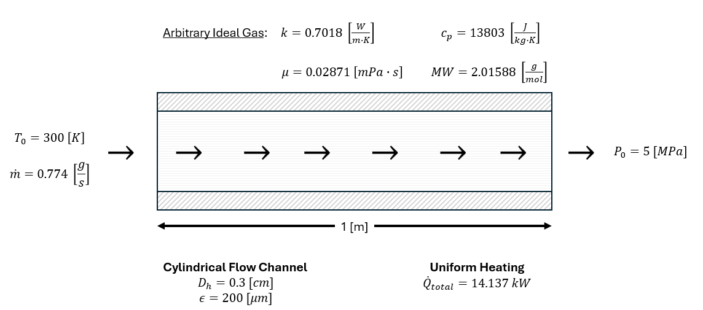
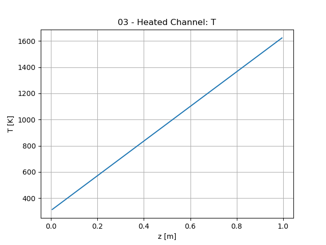
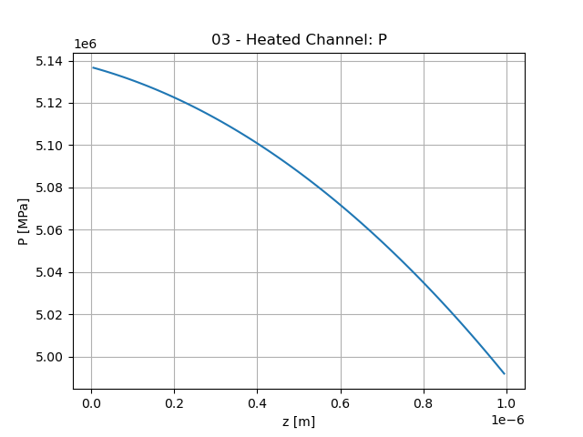
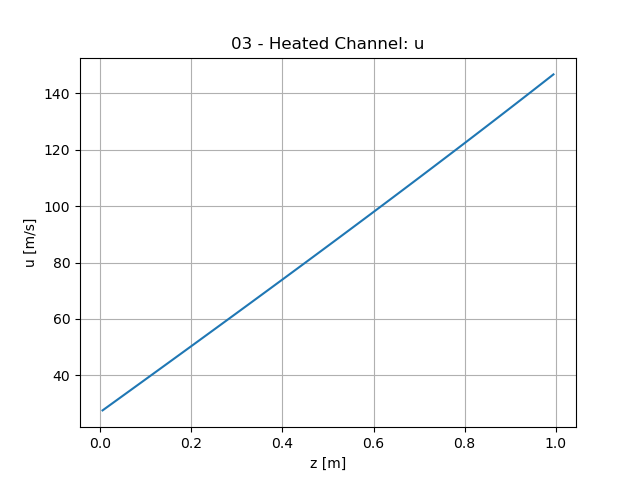
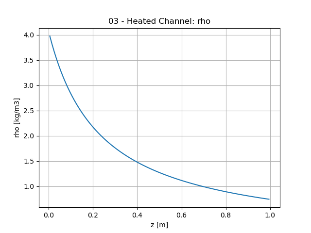

03 - Heated Channel
==========================

This is a simple example of how to use the ``Flow`` model. The ``Flow`` model
solves the 1D compressible Euler equations using an Upwind Finite Volume Method.
This model is used to determine the bulk fluid temperature, pressure, velocity
and density in a gas cooled reactor. When coupled to a ``Thermal`` model, the
``Flow`` model can provide insight into the heat removed from the reactor.

The example flow problem is detailed in the diagram below.

   An illustration of the problem.

Note that the heating values are inputs and not calculated by the model, so some
heating values are provided in the problem statement.

The process of instantiating the ``Problem`` and adding a ``Model`` is similar
to past examples. The only difference here is the type of ``Model`` we're using
and its associated parameters.

Define Flow Model Parameters
----------------------------

Similar to how the ``Thermal`` model in previous examples needed a 3D mesh and a
Cedar material properties object, a ``Flow`` model needs a a 1D mesh and a Cedar
fluid properties object.

Based on the parameters provided to the ``Mesh1D`` object, the mesh will have
100 cells and be 1 [m] long.

.. code-block:: python

    # Build 1D Mesh for Flow Model
    mesh = cedar.Mesh1D(N_cells = 100, start_z = 0, end_z = 1, region = "fc", boundary = "fc_wall")

    # Define Fluid Properties
    fluid = cedar.fluids.IdealGas(k = 0.7018, cp = 13803, mu = 2.8710e-5, molar_mass = 2.01588)

Instantiate the Flow Model
--------------------------

Now that we have the mesh and fluid properties object, the only other pieces of
information we need are related to the geometry of the flow channel.

- ``Dh`` is the hydraulic diameter, which for the case of a cylindrical channel is just the diameter.
- ``A`` is the cross-sectional flow area of the channel. 
- ``P_wall`` is the wetted perimeter of the flow channel. This is only used to calculate the wall temperature during post-processing.
- ``eps`` is the average roughness of the flow channel.

With that, we can instantiate the flow model.

.. code-block:: python

    # Instantiate Model
    flow = cedar.models.Flow("flow", mesh, fluid, Dh = 0.003, A = 0.00000706858,
                            P_wall = 0.00942477796, eps = 200e-6)

Set Source, BCs, and ICs
------------------------

By default, the ``Flow`` model has a heat source term of zero and BCs that
correspond to atmospheric temperature and pressure with a flow velocity of 1
[m/s].

For this example, we set the heat source to 14,137 [W] which corresponds to a
volumetric heat source of 2e9 [W/m^3].

Next, we have to adjust the BCs to represent the problem at hand. We set the
values of both the inlet and outlet to these representative values. Note that by
definition, the P0 of the inlet, and the T0 and mdot of the outlet are outputs
of the ``Flow`` model, so the value we set them to is arbitrary since they'll be
overwritten once the ``Flow`` model is solved.

The initial conditions for ``T``, ``P``, and ``u`` are set to 300 [K], 5 [MPa],
and 1 [m/s] respectively. If the default (atmospheric) initial conditions are
used, the initial guess of the solution will be too wrong and the ``Problem``
will not converge.

.. code-block:: python

    # Set Heat Source
    flow.vars.Qdot.set(14137.16)

    # Set Flow Boundary Conditions
    flow.vars.inlet.set(T0 = 300, P0 = 5e6, mdot = 0.00077368421)
    flow.vars.outlet.set(T0 = 300, P0 = 5e6, mdot = 0.00077368421)

    # Adjust initial conditions.
    flow.vars.T.set_initial(300)
    flow.vars.P.set_initial(5e6)
    flow.vars.u.set_initial(1)

Entire Example Problem File
---------------------------

.. code-block:: python

    import cedar

    # Instantiate Problem Object
    problem = cedar.Problem("03_heated_channel")

    # Build 1D Mesh for Flow Model
    mesh = cedar.Mesh1D(N_cells = 100, start_z = 0, end_z = 1, region = "fc", boundary = "fc_wall")

    # Define Fluid Properties
    fluid = cedar.fluids.IdealGas(k = 0.7018, cp = 13803, mu = 2.8710e-5, molar_mass = 2.01588)

    # Instantiate Model
    flow = cedar.models.Flow("flow", mesh, fluid, Dh = 0.003, A = 0.00000706858, P_wall = 0.00942477796, eps = 200e-6)

    # Set Heat Source
    flow.vars.Qdot.set(14137.16)

    # Set Flow Boundary Conditions
    flow.vars.inlet.set(T0 = 300, P0 = 5e6, mdot = 0.00077368421)
    flow.vars.outlet.set(T0 = 300, P0 = 5e6, mdot = 0.00077368421)

    # Adjust initial conditions.
    flow.vars.T.set_initial(300)
    flow.vars.P.set_initial(5e6)
    flow.vars.u.set_initial(1)

    # Add Problem to Model and Solve
    problem.add_model(flow)
    problem.solve()

Outputs
-------

Below are plots of the temperature, pressure, velocity, and density calculated
by the ``Flow`` model.

