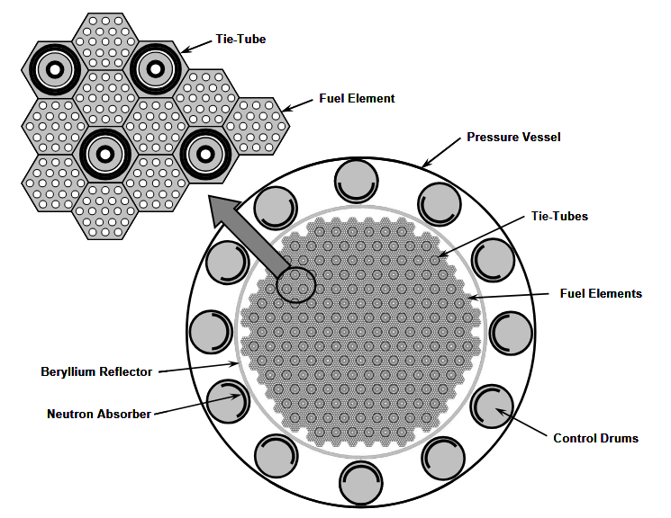
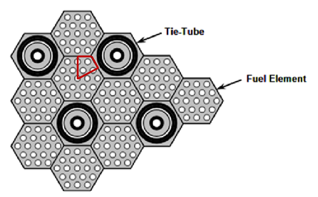
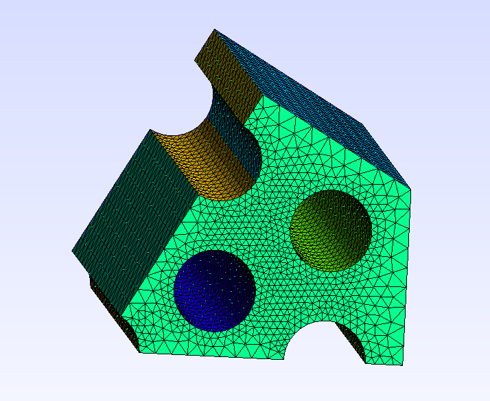
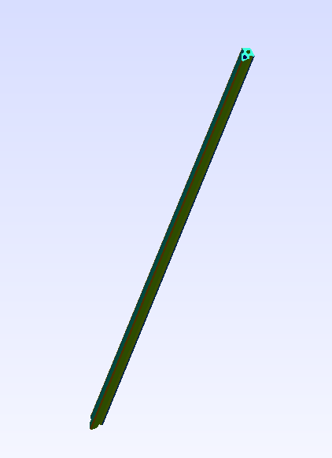
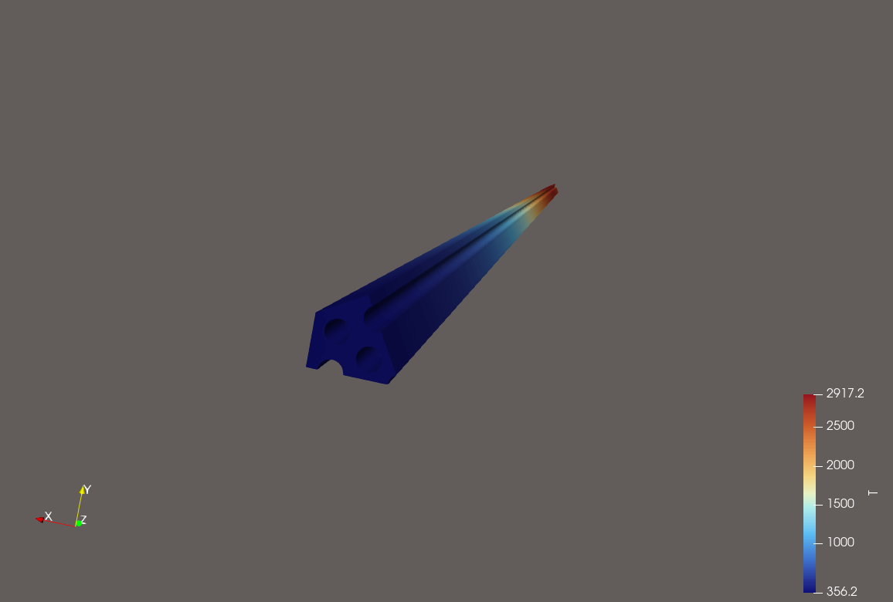
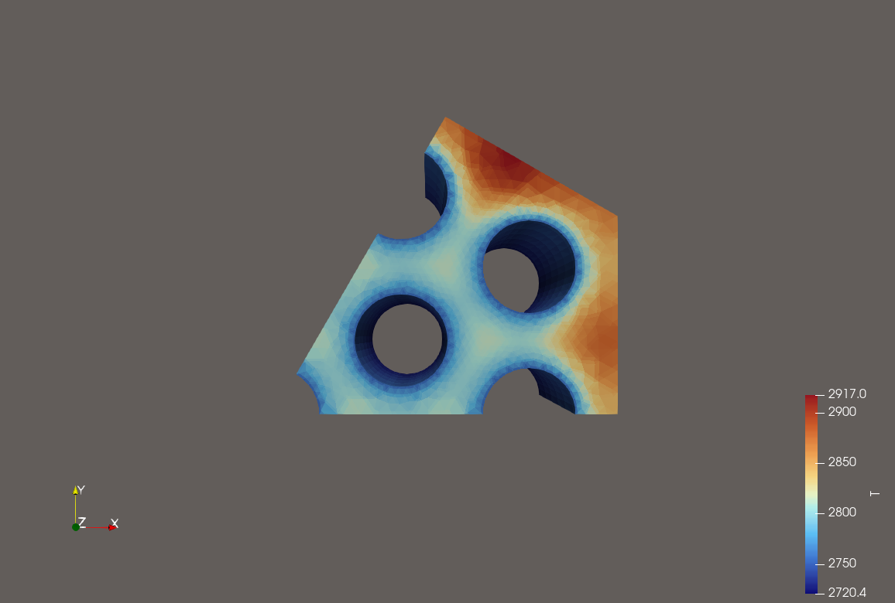
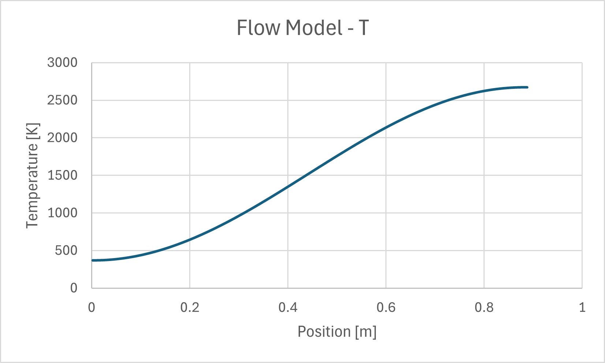
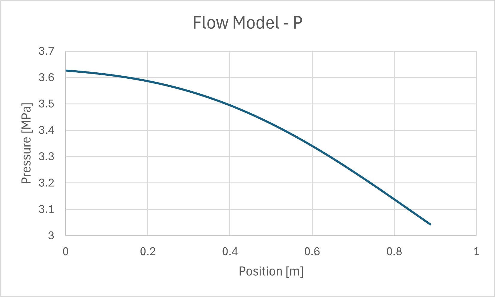
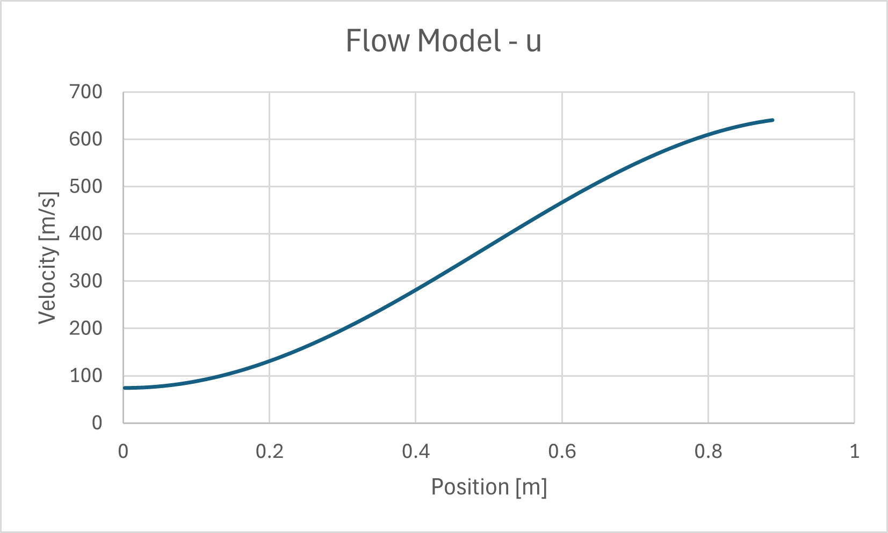

04 - SNRE FE
==========================

This example introduces the concept of coupling Cedar models. It is a coupled
thermal-flow problem of a fuel element (FE) from the Small Nuclear Rocket Engine
(SNRE).

   Cross-section view of the SNRE reactor core [Fittje_2015]_.

The problem is simplified by assuming that neighboring fuel elements do not
exchange much heat since they're at similar temperatures and that the heat
transfer to a tie tube element can be approximated by a uniform heat flux.

These assumptions allow us to take advantage of symmetry and only consider a
slice of the computational domain.

    Slice of the computational domain.

    The meshed domain, created using GMSH.

    The meshed domain, created using GMSH.

.. note::
    The cladding is not modeled in this example by assuming that the thermal conductivity of ZrC is similar to UC_ZrC_C and that spreading the heat deposition to the cladding will negligibly affect the temperature distribution.

The boundary conditions, sources, and mesh dimensions are taken from the Engine
Description Report [Durham_1972]_.

Flow BCs:

- Inlet T0 = 370.1 [K]
- Inlet mdot = 14.77 [g/s] per FE
- Outlet P0 = 3.1 [MPa]

Thermal BCs and Source:

- Qdot = 616.9 [kW] per FE
- Heat Flux to Tie Tube Element = 37.6 [kW]

.. note::
    Since we took advantage of symmetry when defining the problem domain, the inlet mdot, Qdot, and Heat Flux to Tie Tube Element values must be divided by 6 when applying them in Cedar.

The final assumption applied in this example is that the relative heating
fraction in the fuel is a cosine shape in the axial direction, with no radial
dependence.

Instantiating Problem
---------------------
First, we instantiate a Cedar problem, just like we did for the other examples.

.. code-block:: python

    # Instantiate Problem
    problem = cedar.Problem("04_snre_fe")

Instantiating the Thermal Model
-------------------------------

Next, we calculate some values associated with the source term and boundary
conditions. We have to pay special attention here that we use the proper values
since we're using a 1/6th slice of the FE.

.. code-block:: python

    # Qdot for 1/6th of a FE
    fe_Qdot = 0.94809*366.97e6/(564*6)

    # Calculate heat flux to tie tube element
    Qdot_to_tie_tube = 0.061*fe_Qdot
    flux_to_tie_tube = Qdot_to_tie_tube / 0.00978911

We can instantiate the ``Thermal`` model and associated mesh similar to how we
did in past examples.

.. code-block:: python

    # Instantiate Model
    thermal_mesh = cedar.Mesh3D("04_snre_fe.msh")
    thermal = cedar.models.Thermal("thermal", thermal_mesh, {"fuel": cedar.materials.UC_ZrC_C()})

    # Set the global heating value for the thermal model
    thermal.set_Qdot(fe_Qdot)

Next, we're going to apply a shape to our ``Qdot``. In some instances, like for
the ``Thermal`` model, Cedar has two variables to separate the magnitude and the
shape. This is done to so there is no confusion about conservation of energy
when communicating between two models. In this example, ``Qdot`` tells the
``Thermal`` model what the total magnitude of heat deposited in a region, and
``Qdot_shape`` tells the ``Thermal`` model how much (relative) heat is deposited
in each cell. 

``Qdot_shape`` is normalized internally when the model is solved, so we just
need to apply some relative shape when defining the problem.

.. code-block:: python

    # Set a cosine relative heating fraction shape.
    thermal.vars.Qdot_shapes["fuel"].set([np.sin(np.pi*center[2]/0.89) for center in thermal_mesh.cell_centers])

Next, we set the BCs and ICs.

The ``wall_to_tietube`` boundary condition is set to a uniform heat flux which
calculated earlier.

The ``fc_wall`` boundary condition is set to an initial guess which is a linear
increase in temperature from 370 to 3000 in the direction of the flow. Note that
this value will only be used in the first iteration, because after that the
value will be updated via model coupling. This doesn't do anything to the final
solution, but might speed up convergence.

``T.initial`` for the ``Thermal`` model is set to the same initial guess as the
``fc_wall`` BC. Since this is a steady state problem, this is, once again, only
to potentially speed up the solve.

.. code-block:: python

    # Change the BC for wall to the tie tube to heat flux instead of adiabatic.
    thermal.set_bc("wall_to_tietube", "neumann", flux_to_tie_tube)

    # Calculate ICs
    T_ic = [370 + (3000-370)*center[2]/0.89 for center in thermal_mesh.cell_centers]
    T_wall_ic = [370 + (3000-370)*center[2]/0.89 for center in thermal_mesh.face_centers[thermal_mesh.boundaries["fc_wall"]]]

    # Set the BC at fc_wall to Dirichlet for coupling.
    thermal.set_bc("fc_wall", "dirichlet", T_wall_ic)

    # Set better initial guess to speed up convergence.
    thermal.vars.T.set_initial(T_ic)

Instantiating the Flow Model
----------------------------
Instead of applying a heat removal boundary condition to the thermal model, we
are instead going to calculate the heat removal by using a flow model. In this
scenario, we use one representative flow model for all flow channels.

The fluid properties use an ideal gas formulation of Parahydrogen at
representative temperature and pressure.

Note that the flow area, wall perimeter, and ``mdot`` are divided by 6 to match the
slicing done in this problem. However, the hydraulic diameter, roughness, ``T0``,
and ``P0``, are not since these are independent of symmetric slicing.

.. code-block:: python

    flow_mesh = cedar.Mesh1D(200, 0, 0.89, "fc", "fc_wall")
    fluid = cedar.fluids.IdealGas(k = 0.983, cp = 17500, mu = 0.0000334346923392326, molar_mass = 2.01588)
    fc_or = 0.23654/200
    flow = cedar.models.Flow("flow", flow_mesh, fluid, Dh = 2*fc_or, A = (np.pi*fc_or**2)*19/6, P_wall = np.pi*2*fc_or*19/6, eps = 25e-6)
    
    # Flow BCs
    flow.vars.inlet.set([370.1, 3.1e6, 8.33/(564*6)])
    flow.vars.outlet.set([370.1, 3.1e6, 8.33/(564*6)])

    # Flow ICs
    flow.vars.P.set_initial(3.1e6)
    flow.vars.T.set_initial(370)
    flow.vars.u.set_initial(10)

Coupling Variables
------------------

This is where the magic happens in Cedar. The ``Thermal`` model and the ``Flow``
model represent two distinct sets of physics that can separately provide useful
insight. However, we can couple variables from one model to replace unknown
boundary conditions.

In this example, we don't know the value of the heat flux through the flow
channel walls since that is dependent on the flow temperature. We also don't
know the flow temperature because that's dependent on the heat flux through the
flow channel walls. Cedar can solve this relation for you through the use of a
non-linear fixed point iteration scheme. We just need to specify which variables
to couple, and how to adapt them to each other.

First, we are going to couple the total heat transfer at the flow channel wall
boundary (the source), ``thermal.vars.boundary_Qdots["fc_wall"]`` to the total
heating value of the flow model ``flow.vars.Qdot`` (the target). The adapter is
``cedar.adapters.Summation`` which instructs Cedar to map the source to the
target by summing the constituents. In this case, since the source is a
``Mesh3DVar`` and the target is a ``ScalarVar``, the all source values are
simply added together and assigned to the target value.

.. code-block:: python

    problem.couple(thermal.vars.boundary_Qdots["fc_wall"], flow.vars.Qdot, cedar.adapters.Summation)

The next coupling is similar to the first, except instead of the target being
``flow.vars.Qdot``, the target is now ``flow.vars.Qdot_shape``. Sources can be
coupled to multiple targets, but a target can only be coupled to one source.
``flow.vars.Qdot_shape`` is the relative power fraction to each cell in the flow
model. We once again use a ``cedar.adapters.Summation`` adapter, but in behaves
differently in this case since the target is now a ``Mesh1DVar``. It will now
sum all values of ``flow.vars.Qdot`` but discretized in the z-direction based on
the ``Mesh1D`` used by the ``Flow`` model. When the ``Flow`` model iterates, it
will normalize this ``Qdot_shape`` internally to explicitly ensure conservation
of energy transferred between these two models.

.. code-block:: python

    problem.couple(thermal.vars.boundary_Qdots["fc_wall"], flow.vars.Qdot_shape, cedar.adapters.Summation)

The last coupling is the calculated flow channel wall temperature from the
``Flow`` model to the ``Thermal`` model's fixed temperature boundary condition.
In this case, ``flow.vars.T_wall`` is the source and
``thermal.vars.bcs["fc_wall"]`` is the target. The adapter we use here is
``cedar.adapters.NearestValue`` which instead of summing the source values, will
instead select a single source value that is closest in space to the target. In
this case, the source is a ``Mesh1DVar`` and the target is a ``Mesh3DVar``, so
for every cell face center in the fc_wall boundary, the adapter will find which
value from the ``Mesh1DVar`` is physically closest and assign that value.

.. code-block:: python

    problem.couple(flow.vars.T_wall, thermal.vars.bcs["fc_wall"], cedar.adapters.NearestValue)

Add Models to Problem and Solve
-------------------------------

.. code-block:: python

    problem.add_model(thermal)
    problem.add_model(flow)

    problem.solve()

Entire Example Problem File
---------------------------

.. code-block:: python

    import cedar
    import numpy as np

    # Instantiate Problem
    problem = cedar.Problem("04_snre_fe")

    # THERMAL MODEL
    # =============================================================================
    # Qdot for 1/6th of a FE
    fe_Qdot = 0.94809*366.97e6/(564*6)

    # Calculate heat flux to tie tube element
    Qdot_to_tie_tube = 0.061*fe_Qdot
    flux_to_tie_tube = Qdot_to_tie_tube / 0.00978911

    # Instantiate Model
    thermal_mesh = cedar.Mesh3D("snre_fe_786141.msh")
    thermal = cedar.models.Thermal("thermal", thermal_mesh, {"fuel": cedar.materials.UC_ZrC_C()})

    # Set the global heating value for the thermal model
    thermal.set_Qdot(fe_Qdot)

    # Set a cosine relative heating fraction shape.
    thermal.vars.Qdot_shapes["fuel"].set([np.sin(np.pi*center[2]/0.89) for center in thermal_mesh.cell_centers])

    # Change the BC for wall to the tie tube to heat flux instead of adiabatic.
    thermal.set_bc("wall_to_tietube", "neumann", flux_to_tie_tube)

    # Calculate ICs
    T_ic = [370 + (3000-370)*center[2]/0.89 for center in thermal_mesh.cell_centers]
    T_wall_ic = [370 + (3000-370)*center[2]/0.89 for center in thermal_mesh.face_centers[thermal_mesh.boundaries["fc_wall"]]]

    # Set the BC at fc_wall to Dirichlet for coupling.
    thermal.set_bc("fc_wall", "dirichlet", T_wall_ic)

    # Set better initial guess to speed up convergence.
    thermal.vars.T.set_initial(T_ic)

    # FLOW MODEL
    # =============================================================================
    flow_mesh = cedar.Mesh1D(200, 0, 0.89, "fc", "fc_wall")
    fluid = cedar.fluids.IdealGas(k = 0.983, cp = 17500, mu = 0.0000334346923392326, molar_mass = 2.01588)
    fc_or = 0.23654/200
    flow = cedar.models.Flow("flow", flow_mesh, fluid, Dh = 2*fc_or, A = (np.pi*fc_or**2)*19/6, P_wall = np.pi*2*fc_or*19/6, eps = 25e-6)
    
    # Flow BCs
    flow.vars.inlet.set([370.1, 3.1e6, 8.33/(564*6)])
    flow.vars.outlet.set([370.1, 3.1e6, 8.33/(564*6)])

    # Flow ICs
    flow.vars.P.set_initial(3.1e6)
    flow.vars.T.set_initial(370)
    flow.vars.u.set_initial(10)

    # COUPLING
    # =============================================================================
    problem.couple(thermal.vars.boundary_Qdots["fc_wall"], flow.vars.Qdot, cedar.adapters.Summation)
    problem.couple(thermal.vars.boundary_Qdots["fc_wall"], flow.vars.Qdot_shape, cedar.adapters.Summation)
    problem.couple(flow.vars.T_wall, thermal.vars.bcs["fc_wall"], cedar.adapters.NearestValue)

    # SOLVE
    # =============================================================================
    problem.add_model(thermal)
    problem.add_model(flow)

    problem.solve()

Outputs
-------
===================== ======= ========================== =============================
      |space|          Cedar   T/H Study [Fittje_2015]_   SNRE Design [Durham_1972]_
===================== ======= ========================== ============================= 
Flow Outlet T [K]      2685             2679                        2668
Max Fuel T [K]         2917             2897                        2800
Pressure Drop [MPa]    0.53              0.5                         0.5
===================== ======= ========================== ============================= 

 

    Temperature contour plot.

    Temperature contour plot.

    Flow temperature.

    Flow pressure.

    Flow velocity.

.. note::
    The flow model uses outlet stagnation pressure as a boundary condition but what is plotted above is static pressure.

References
----------

.. [Fittje_2015] J. E. Fittje, S. Borowoski, and B. G. Schnitzler, “Revised point of
          departure design options for nuclear thermal propulsion,” AIAA SPACE
          2015 Conference and Exposition, Aug. 2015. doi:10.2514/6.2015-4547

.. [Durham_1972] F. P. Durham, “Nuclear Engine Definition Study
    Preliminary Report, Volume 1 - Engine Description,” Los Alamos National
    Laboratory, Report LA-5044-MS Vol 1, Los Alamos, NM, Sept. 1972.

.. |space| unicode:: 32