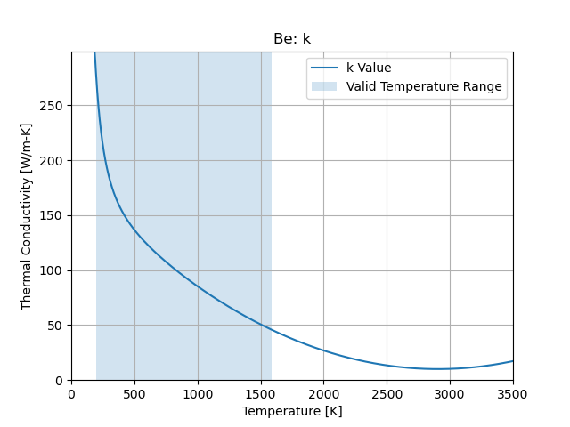
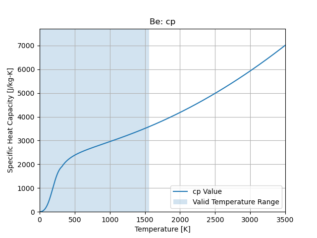

Beryllium
=========

``cedar.materials.Be()``

Density
-------

1848 [kg/m3]

Thermal Conductivity
--------------------

Valid Temperature Range:

.. math::
   200 \le T \le 1589

   Thermal Conductivity

Specific Heat Capacity
--------------------

Valid Temperature Range:

.. math::
   5 \le T \le 1560

   Specific Heat Capacity

References
----------

SNP-HDBK-0008 SNP Material Property Handbook
https://ntrs.nasa.gov/citations/20240004217

