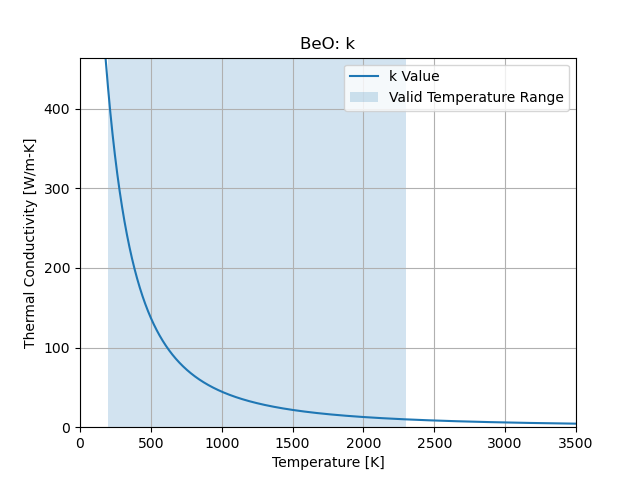
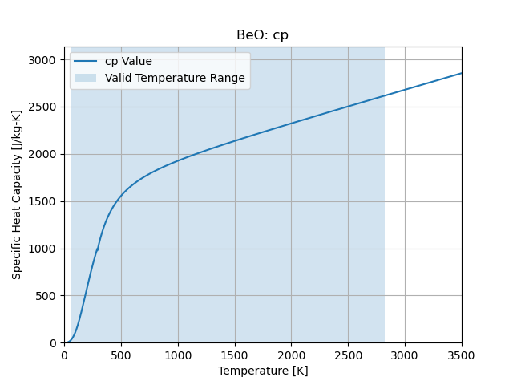

Beryllium Oxide
===============

``cedar.materials.BeO()``

Density
-------

3010 [kg/m3]

Thermal Conductivity
--------------------

Valid Temperature Range:

.. math::
   200 \le T \le 2301

   Thermal Conductivity

Specific Heat Capacity
----------------------

Valid Temperature Range:

.. math::
   55 \le T \le 2820

   Specific Heat Capacity

References
----------

SNP-HDBK-0008 SNP Material Property Handbook
https://ntrs.nasa.gov/citations/20240004217

