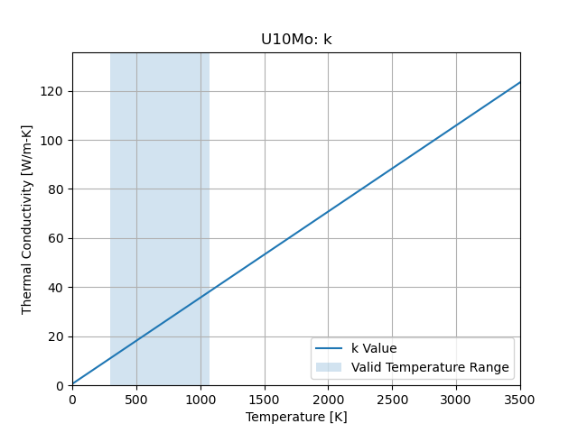
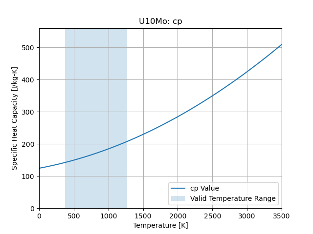

Uranium 10-Molybdenum Alloy
===========================

``cedar.materials.U10Mo()``

Density
-------

(1-Porosity)*17150.0 [kg/m3]

Thermal Conductivity
--------------------

Valid Temperature Range:

.. math::
   293.15 \le T \le 1073.15

   Thermal Conductivity

Specific Heat Capacity
----------------------

Valid Temperature Range:

.. math::
   373.15 \le T \le 1273.15

   Specific Heat Capacity

References
----------

D. E. Burkes, et. al., "Thermophysical Properties of U-10Mo Alloy," Idaho
National Laboratory, Report INL/EXT-10-19373, Idaho Falls, ID, Nov. 2010.

