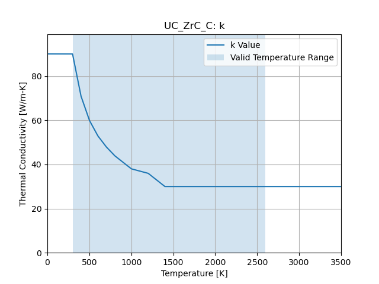
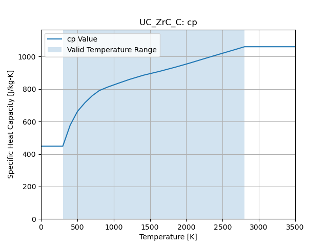

Uranium Zirconium Carbide Composite
===================================

``cedar.materials.uc_zrc_c()``

Density
-------

6700 [kg/m3]

Thermal Conductivity
--------------------

Valid Temperature Range:

.. math::
   300 \le T \le 2600

   Thermal Conductivity

Specific Heat Capacity
----------------------

Valid Temperature Range:

.. math::
   300 \le T \le 2800

   Specific Heat Capacity

References
----------

L. L. Lyon, “Performance of (U, Zr)C-Graphite (Composite) and of (U, Zr)C
(Carbide) Fuel Elements in the Nuclear Furance 1 Rest Reactor,” Los Alamos
National Laboratory, Report LA-5398-MS Vol 1, Los Alamos, NM, Sept. 1973.