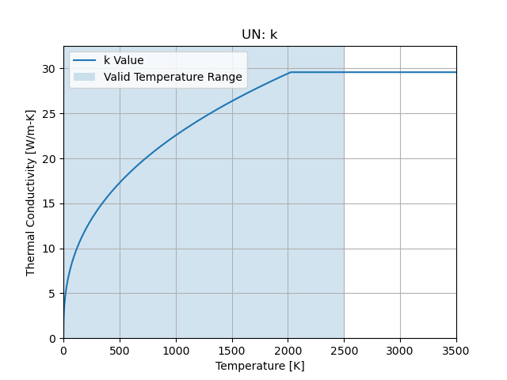
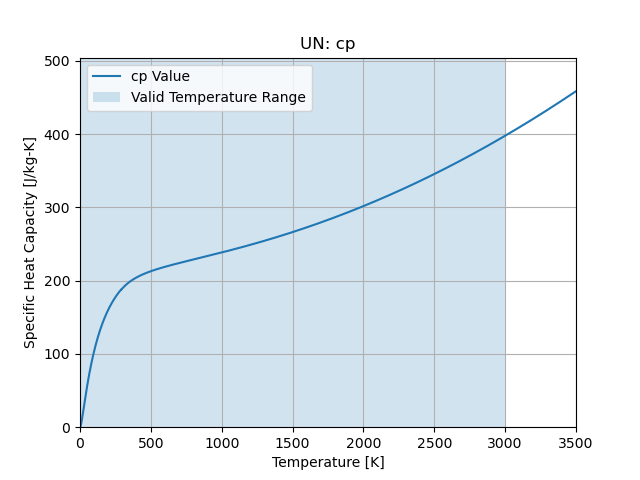

Uranium Nitride
===============

``cedar.materials.UN()``

Density
-------

(1-Porosity)*14330 [kg/m3]

Thermal Conductivity
--------------------

Valid Temperature Range:

.. math::
   10 \le T \le 2500

   Thermal Conductivity

Specific Heat Capacity
----------------------

Valid Temperature Range:

.. math::
   5 \le T \le 3000

   Specific Heat Capacity

References
----------

SNP-HDBK-0008 SNP Material Property Handbook
https://ntrs.nasa.gov/citations/20240004217

