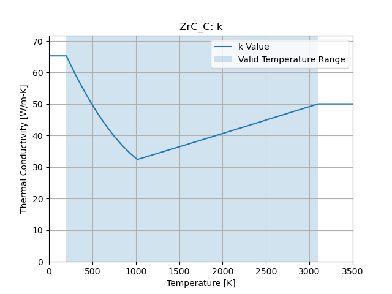
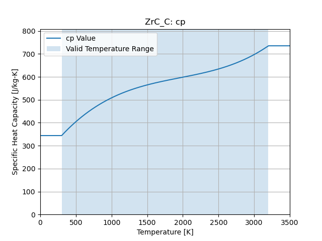

Zirconium Carbide Composite
====================================

Room Temperature Properties
---------------------------

.. list-table::
   :header-rows: 1

   * - Property
     - Value
     - Units
   * - Density
     - 6700.0
     - :math:`\frac{kg}{m^3}`
   * - Thermal Conductivity
     - 60.0
     - :math:`\frac{W}{m-K}`
   * - Specific Heat Capacity
     - 344.1
     - :math:`\frac{J}{kg-K}`

Thermal Conductivity
--------------------

   Thermal Conductivity

.. math::
   Valid Range: 200.0 K \le T \le 3100.0 K

Specific Heat Capacity
----------------------

   Specific Heat Capacity

.. math::
   Valid Range: 300.0 K \le T \le 3200.0 K
